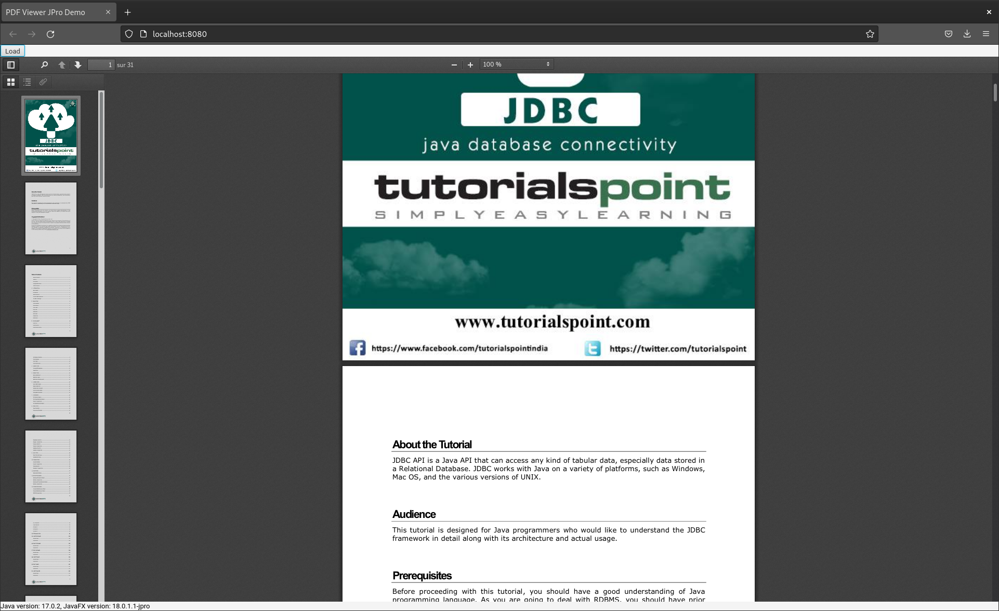

# PDFViewerFxForJPRO

[](https://jitpack.io/#guirak/PDFViewerFxForJpro)
[](https://github.com/guirak/PDFViewerFxForJpro/commits/master)
[](https://github.com/guirak/PDFViewerFxForJpro/issues)
[](LICENSE)

#### A library for displaying/viewing pdf documents inside your javaFX application
This library is actually a JavaFX wrapper for Mozilla's [PDF.js](https://github.com/mozilla/pdf.js/) javascript library, but with this library you don't have to
deal with any javascript code, so you can just use a java object to view pdf documents in javaFX. 

The library is a fork of the [Dansoftowner/PDFViewerFX](https://github.com/Dansoftowner/PDFViewerFX) that provides additional features to be compatible with JPRO.

When running your app as Native app, the library will use the JavaFX [WebView](https://openjfx.io/javadoc/17/javafx.web/javafx/scene/web/WebView.html) to display [PDF.js](https://github.com/mozilla/pdf.js/).

When running your app on a JPRO server, the library will use the JPRO [HtmlView](https://www.jpro.one/api/2022.1.3/com/jpro/webapi/HTMLView.html) to display [PDF.js](https://github.com/mozilla/pdf.js/).

## How to get it?

Releases are available through [JitPack](https://jitpack.io/#Dansoftowner/PDFViewerFX):

### Maven

```xml
<repositories>
    <repository>
        <id>jitpack.io</id>
        <url>https://jitpack.io</url>
    </repository>
</repositories>
```

```xml
<dependency>
    <groupId>com.github.guirak</groupId>
    <artifactId>PDFViewerFxForJpro</artifactId>
    <version>1.0</version>
</dependency>
```  

### Gradle

```groovy
repositories {
    ...
    maven { url 'https://jitpack.io' }
}
```

```groovy
dependencies {
    implementation 'com.github.guirak:PDFViewerFxForJpro:1.0'
}
```

## Configuring for JPRO

The PDF Viewer use an integrated Apache PDF.js.

To be accessible with JPRO, the used PDF.js must be copied into the **jpro/html folder**. 

For example, if you want to use the version **2.2.228**, you must copy the **pdfjs_2.2.228** from this git repository into a folder **jpro/html/pdfjs/** of you JPRO project. 

The project structure will look like this :

```
project
│    README.md
│    file001.txt    
│
└─── src
│    └─── main
│    │    └─── java
│    │    └─── resources
│    │    │    └─── jpro/html
│    │    │    │    │    index.html
│    │    │    │    └─── pdfjs
│    │    │    │    │    └─── pdfjs_2.2.228

```

The demo project **demos/jpro** is a good example of how to use the PDF viewer with JPRO.

## Implementation

First, you have to import the necessary class:
```java
import com.dansoftware.PDFDisplayer;
```

```java
PDFDisplayer displayer = new PDFDisplayer();

primaryStage.setScene(new Scene(displayer.toNode())); // to create the javaFX object from the displayer, you have to use the toNode() function 
primaryStage.show();

/*
 * This method creates a FileInputStream and than wraps it into a
 * BufferedInputStream, and then read the data from it.
*/
displayer.loadPDF(new File("path/to/your/file.pdf"));
```

You can also load the pdf from a java.net.URL object:
```java
/*
 * This method calls the URL.openStream() function to get the InputStream then wraps it into a
 * BufferedInputStream, and then read the data from it.
*/
displayer.loadPDF(new URL("https://www.tutorialspoint.com/jdbc/jdbc_tutorial.pdf"));
```

Or you can read the data from any kind of InputStream:
```java
InputStream inputStream = getAnInputStream(); //just for representation
displayer.loadPDF(inputStream);
```

You can use the constructors as well:
```
PDFDisplayer(URL); //reads the data from the URL
PDFDisplayer(File); //reads the data from the File
PDFDisplayer(InputStream) //reads the data from the InputStream 
```


## Projects using `PDFViewerFxForJPRO`
If this library is used by your project, let me know in the `Discussions` and I will mention that in this section.

* [Document Archiver](https://github.com/Document-Archiver/com.sophisticatedapps.archiving.document-archiver) - Archive all your documents in a consistent way, which enables you to retrieve them later fast and easy.

## Screenshots (Native app)


## Screenshots (JPRO app)


